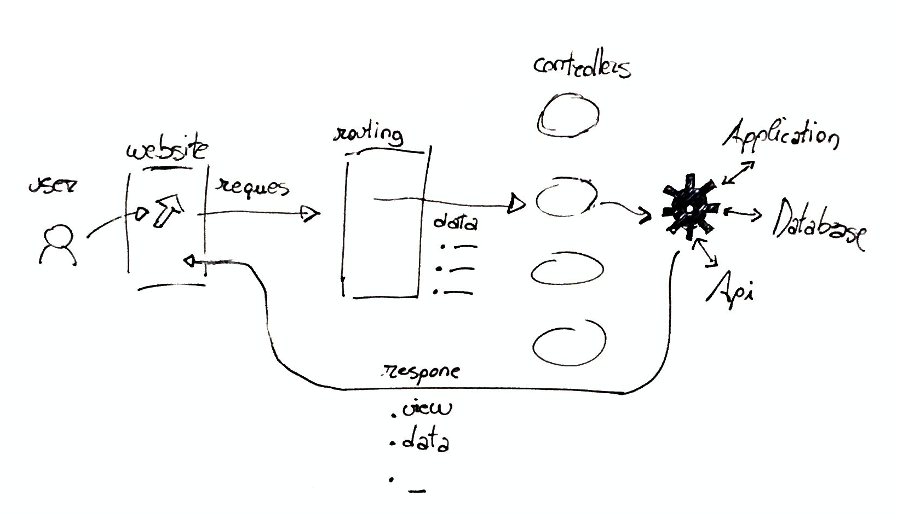

# Introduction

## At a glance

Basically, __Laravel__ takes user request and return a response. 


## Requirements

To run Laravel, you need to have:

- php
- database
- composer (dependency manager for PHP)

To install composer, download it:

```
php -r "copy('https://getcomposer.org/installer', 'composer-setup.php');"
php -r "if (hash_file('sha384', 'composer-setup.php') === 'e0012edf3e80b6978849f5eff0d4b4e4c79ff1609dd1e613307e16318854d24ae64f26d17af3ef0bf7cfb710ca74755a') { echo 'Installer verified'; } else { echo 'Installer corrupt'; unlink('composer-setup.php'); } echo PHP_EOL;"
php composer-setup.php
php -r "unlink('composer-setup.php');"
```

and then install it globally:

```
mv composer.phar /usr/local/bin/composer
```

## Laravel Installer

First, you need to install Laravel globally on your machine. The installation process depends from your operating system.

```composer global require laravel/installer```

Once you have Laravel installed, you can start a new project running:

```laravel new project```

The Laravel Installer will create a folder called `project` and put inside everything you need.

You can see your projet working by running:

```php artisan serve```

Normally, you can see your website opening a brower and visiting:

http://127.0.0.1:8000

## Laravel Valet

To running project in local, you have two options in Laravel:

- Homestead
- Valet

### Homestead

Homestead in a complex tool that will use Vagrant for creating a virtual machine that can run Laravel.

For most projects, this is a too complex and unnecessary complicated.

### Valet

Valet is avaiable only for Mac Os. Basically, Valet with map all the folders in a choosen folder to a `project_folder_name.test` url, always avaiable.
